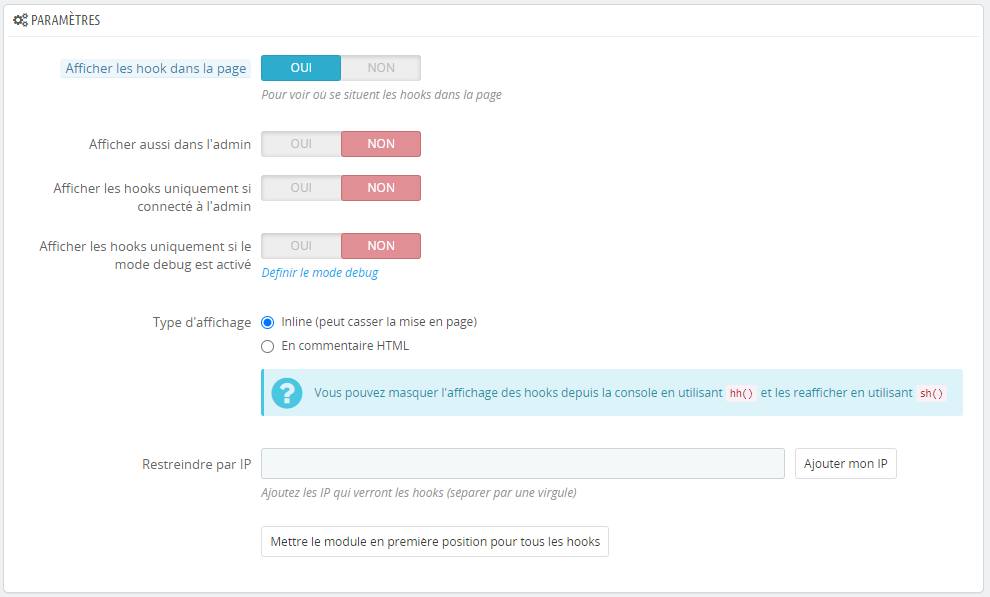
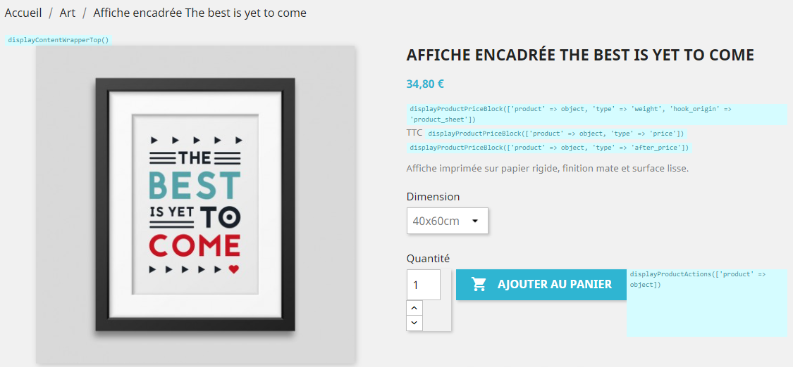

# Visualisation des hooks

> Ce module configurable permet d'afficher les hooks sur le site et dans l'administration

- Afficher ou non les hooks sur le site
- Les afficher ou non dans l'administration
- Les afficher uniquement si on est connecté à l'administration
- Les afficher uniquement si le mode debug est activé
- Type d'affichage _inline_ ou en _commentaire HTML_
- Informations précises au clic sur le hook
- Restriction par adresse IP

[Demo](http://prestashop.definima.net/)

## Installation

Télécharger le fichier [rs_hookviewer-1.2.0.zip](rs_hookviewer-1.2.0.zip) et l'installer depuis l'administration de Prestashop comme un module normal.

Testé sur les versions <code>1.7.7.1</code>, <code>1.7.6.8</code>, <code>1.7.4.2</code>

## Captures
Configuration du module :

Affichage des hooks dans la page :

Informations du hook :

## Hooks
Le module est automatiquement greffé à tous les hooks disponibles lors de l'installation (récupérés dans la BDD).

[Liste (presque) complète](https://devdocs.prestashop.com/1.7/modules/concepts/hooks/list-of-hooks/)

**Attention** : il se peut que le fonctionnement soit altéré. Si tel est le cas, il faut ajouter le hook incriminé dans la constante `HOOK_TO_EXCEPT` du module.
