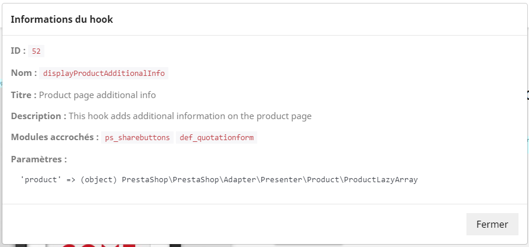

# Hook viewer

> This configurable module allows you to display hooks on the site and in the administration

- Display or not the hooks on the site
- Display them or not in the administration
- Display them only if you are connected to the administration
- Display them only if debug mode is enabled
- Type of display _inline_ or _HTML comment_
- Precise information when clicking on the hook
- Restriction by IP address

## Compatibility

Tested on the following versions: 
- 1.7.7.2
- 1.7.7.1
- 1.7.6.8
- 1.7.4.2

If you have used it successfully on other versions let me know or create a PR.

## Installation

Download the latest version from [Github releases](https://github.com/rseon/rs_hookviewer/releases).

## Captures

How it is displayed in the list of modules:

Module configuration:

Displaying hooks in the page:

Hook information:

## Hooks

The module is automagically added to all the hooks available during installation (retrieved from the database).

[List (almost) complete](https://devdocs.prestashop.com/1.7/modules/concepts/hooks/list-of-hooks/)

**Warning**: operation may be impaired. If this is the case, you must add the offending hook in the constant `HOOK_TO_EXCEPT` of the module so that it is not taken into account.

## Greetings

[Hervé Hennes](https://www.h-hennes.fr/) whose blog often kept me out of trouble, and the [Friends of Presta](https://friendsofpresta.org/fr) community.
